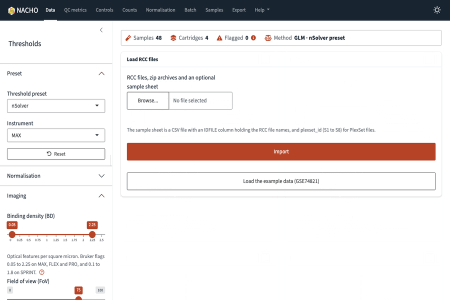
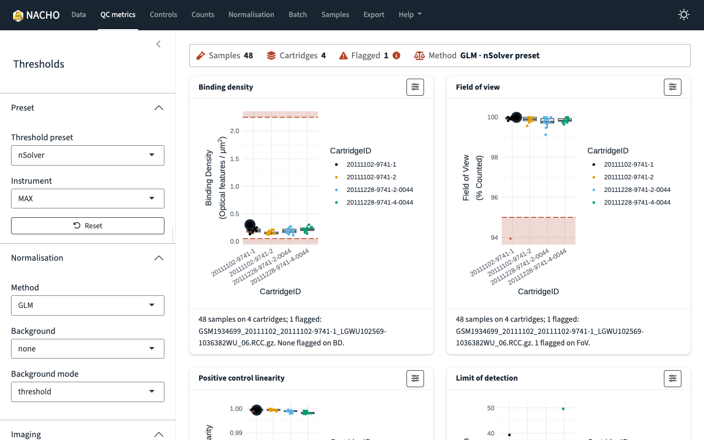

<!-- README.md is generated from README.Rmd. Please edit that file -->

```{r}
#| echo: false
knitr::opts_chunk$set(
  collapse = TRUE,
  comment = "#>",
  fig.path = "man/figures/README-",
  out.width = "100%"
)
```

# NAnoString quality Control dasHbOard 

<!-- badges: start -->
[](https://lifecycle.r-lib.org/articles/stages.html)
[](https://github.com/mcanouil/NACHO)
[](https://app.codecov.io/gh/mcanouil/NACHO?branch=main)
[](https://github.com/mcanouil/NACHO/actions/workflows/R-CMD-check.yml)
[](https://cran.r-project.org/package=NACHO)
[](https://cran.r-project.org/web/checks/check_results_NACHO.html)
[](https://cran.r-project.org/package=NACHO)
<!-- badges: end -->

## Installation

```{r}
#| eval: false
# Install NACHO from CRAN:
install.packages("NACHO")

# Or the development version from GitHub:
# install.packages("pak")
pak::pak("mcanouil/NACHO")
```

## Overview

```{r}
#| echo: false
#| results: asis
cat(readLines(file.path("inst", "about", "about-nacho.md"))[-c(1, 2)], sep = "\n")
```

### Shiny Application ([demo](https://mcanouil.shinyapps.io/NACHO_data/))

Open the app on your data with `visualise()`.

```{r}
#| eval: false
visualise(GSE74821)
```

```{r}
#| echo: false
#| fig-alt: "Short recording of the NACHO app. The example data load, a threshold slider moves, the summary strip changes, a sample is selected and outlined in the plots, and the Export page opens."

```

```{r}
#| echo: false
#| fig-alt: "NACHO app on the QC metrics page, with the threshold sliders on the left and box plots of binding density and field of view for each cartridge."

```

The article [Explore quality control in the app](https://m.canouil.dev/NACHO/articles/nacho-app.html) shows each page.

## Citing NACHO

```{r}
#| echo: false
#| results: asis
print(citation("NACHO"), "html")
```

```{r}
#| echo: false
#| comment: ""
print(citation("NACHO"), "bibtex")
```

---

## Getting help

If you encounter a clear bug, please file a minimal reproducible example on [GitHub](https://github.com/mcanouil/NACHO/issues).  
For questions and other discussion, please contact the package maintainer.

## Code of Conduct

Please note that this project is released with a [Contributor Code of Conduct](https://contributor-covenant.org/version/2/0/CODE_OF_CONDUCT.html).  
By contributing to this project, you agree to abide by its terms.
