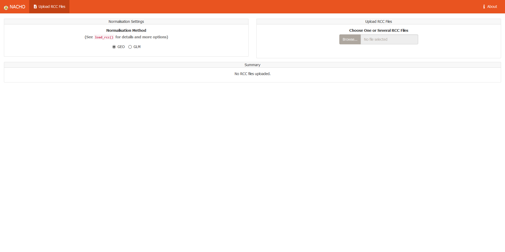

<!-- README.md is generated from README.Rmd. Please edit that file -->

```{r, echo = FALSE}
knitr::opts_chunk$set(
  collapse = TRUE,
  comment = "#>"
)
```

# Nanostring Quality Control Dashboard 

<!-- badges: start -->
[](https://www.tidyverse.org/lifecycle/#stable)
[](https://github.com/mcanouil/NACHO)
[](https://travis-ci.org/mcanouil/NACHO)
[](https://ci.appveyor.com/project/mcanouil/NACHO)
[](https://codecov.io/gh/mcanouil/NACHO)
[](https://bestpractices.coreinfrastructure.org/projects/2719)
[](https://cran.r-project.org/package=NACHO)
[](https://cran.r-project.org/web/checks/check_results_NACHO.html)
[](https://cran.r-project.org/package=NACHO)
<!--[](https://cran.r-project.org/web/checks/check_results_NACHO.html)-->
<!--[](https://cran.r-project.org/package=NACHO)-->
<!--[](https://coveralls.io/github/mcanouil/NACHO?branch=master)-->
<!-- badges: end -->


## Installation

```{r, eval = FALSE}
# Install NACHO from CRAN:
install.packages("NACHO")

# Or the the development version from GitHub:
# install.packages("remotes")
remotes::install_github("mcanouil/NACHO")
```


## Overview 

```{r, echo = FALSE, results = "asis"}
cat(readLines(file.path("inst", "app", "www", "about-nacho.md"))[-c(1, 2)], sep = "\n")
```

### Shiny Application

```{r, eval = FALSE}
shiny::runApp(system.file("app", package = "NACHO"))
```



```{r, eval = FALSE}
visualise(GSE74821)
```


## Citing NACHO

```{r, echo = FALSE, results = "asis"}
print(citation("NACHO"), "html")
```

```{r, echo = FALSE, comment = ""}
print(citation("NACHO"), "bibtex")
```


## Getting help

If you encounter a clear bug, please file a minimal reproducible example on [github](https://github.com/mcanouil/NACHO/issues).  
For questions and other discussion, please contact the package maintainer.

---

Please note that this project is released with a [Contributor Code of Conduct](https://github.com/mcanouil/NACHO/blob/master/.github/CODE_OF_CONDUCT.md).  
By participating in this project you agree to abide by its terms.
