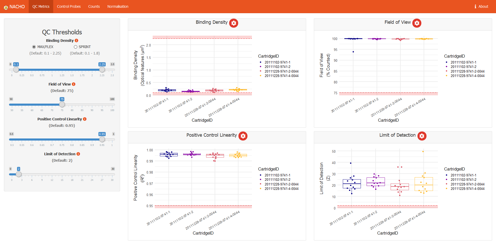

<!-- README.md is generated from README.Rmd. Please edit that file -->

# NAnostring quality Control dasHbOard 

<!-- badges: start -->

[](https://www.tidyverse.org/lifecycle/#stable)
[](https://github.com/mcanouil/NACHO)
[](https://codecov.io/gh/mcanouil/NACHO?branch=main)
[](https://github.com/mcanouil/NACHO/actions)
[](https://cran.r-project.org/package=NACHO)
[](https://cran.r-project.org/web/checks/check_results_NACHO.html)
[](https://cran.r-project.org/package=NACHO)
<!-- badges: end -->

## Installation

``` r
# Install NACHO from CRAN:
install.packages("NACHO")

# Or the development version from GitHub:
# install.packages("remotes")
remotes::install_github("mcanouil/NACHO")
```

## Overview

*NACHO* (**NA**nostring quality **C**ontrol das**H**b**O**ard) is
developed for NanoString nCounter data.  
NanoString nCounter data is a messenger-RNA/micro-RNA (mRNA/miRNA)
expression assay and works with fluorescent barcodes.  
Each barcode is assigned a mRNA/miRNA, which can be counted after
bonding with its target.  
As a result each count of a specific barcode represents the presence of
its target mRNA/miRNA.

*NACHO* is able to load, visualise and normalise the exported NanoString
nCounter data and facilitates the user in performing a quality
control.  
*NACHO* does this by visualising quality control metrics, expression of
control genes, principal components and sample specific size factors in
an interactive web application.

With the use of two functions, RCC files are summarised and visualised,
namely: `load_rcc()` and `visualise()`.

-   The `load_rcc()` function is used to preprocess the data.
-   The `visualise()` function initiates a [Shiny-based
    dashboard](https://shiny.rstudio.com/) that visualises all relevant
    QC plots.

*NACHO* also includes a function `normalise()`, which (re)calculates
sample specific size factors and normalises the data.

-   The `normalise()` function creates a list in which your settings,
    the raw counts and normalised counts are stored.

In addition (since v0.6.0) *NACHO* includes two (three) additional
functions:

-   The `render()` function renders a full quality-control report (HTML)
    based on the results of a call to `load_rcc()` or `normalise()`
    (using `print()` in a Rmarkdown chunk).
-   The `autoplot()` function draws any quality-control metrics from
    `visualise()` and `render()`.

For more `vignette("NACHO")` and `vignette("NACHO-analysis")`.

### Shiny Application ([demo](https://mcanouil.shinyapps.io/NACHO_data/))

``` r
shiny::runApp(system.file("app", package = "NACHO"))
```


``` r
visualise(GSE74821)
```



## Citing NACHO

<p>
Canouil M, Bouland GA, Bonnefond A, Froguel P, Hart L, Slieker R (2019).
“NACHO: an R package for quality control of NanoString nCounter data.”
<em>Bioinformatics</em>. ISSN 1367-4803,
<a href="https://doi.org/10.1093/bioinformatics/btz647">doi:10.1093/bioinformatics/btz647</a>.
</p>

    @Article{,
      title = {{NACHO}: an {R} package for quality control of {NanoString} {nCounter} data},
      author = {Mickaël Canouil and Gerard A. Bouland and Amélie Bonnefond and Philippe Froguel and Leen Hart and Roderick Slieker},
      journal = {Bioinformatics},
      address = {Oxford, England},
      year = {2019},
      month = {aug},
      issn = {1367-4803},
      doi = {10.1093/bioinformatics/btz647},
    }

------------------------------------------------------------------------

## Getting help

If you encounter a clear bug, please file a minimal reproducible example
on [github](https://github.com/mcanouil/NACHO/issues).  
For questions and other discussion, please contact the package
maintainer.

## Code of Conduct

Please note that this project is released with a [Contributor Code of
Conduct](https://contributor-covenant.org/version/2/0/CODE_OF_CONDUCT.html).  
By contributing to this project, you agree to abide by its terms.
