# NACHO


## Installation

``` r

# Install NACHO from CRAN:
install.packages("NACHO")

# Or the development version from GitHub:
# install.packages("pak")
pak::pak("mcanouil/NACHO")
```

``` r

# Load NACHO
library(NACHO)
```

## Overview

*NACHO* (**NA**noString quality **C**ontrol das**H**b**O**ard) is
developed for NanoString nCounter data.  
NanoString nCounter data is a messenger-RNA/micro-RNA (mRNA/miRNA)
expression assay and works with fluorescent barcodes.  
Each barcode is assigned an mRNA/miRNA, which can be counted after
bonding with its target.  
As a result each count of a specific barcode represents the presence of
its target mRNA/miRNA.

*NACHO* is able to load, visualise and normalise the exported NanoString
nCounter data and facilitates the user in performing a quality
control.  
*NACHO* does this by visualising quality control metrics, expression of
control genes, principal components and sample specific size factors in
an interactive web application.

With the use of two functions, RCC files are summarised and visualised,
namely:
[`load_rcc()`](https://m.canouil.dev/NACHO/dev/reference/load_rcc.md)
and
[`visualise()`](https://m.canouil.dev/NACHO/dev/reference/visualise.md).

- The
  [`load_rcc()`](https://m.canouil.dev/NACHO/dev/reference/load_rcc.md)
  function is used to preprocess the data.
- The
  [`visualise()`](https://m.canouil.dev/NACHO/dev/reference/visualise.md)
  function initiates a [Shiny-based dashboard](https://shiny.posit.co/)
  that visualises all relevant QC plots.

*NACHO* also includes a function
[`normalise()`](https://m.canouil.dev/NACHO/dev/reference/normalise.md),
which (re)calculates sample specific size factors and normalises the
data.

- The
  [`normalise()`](https://m.canouil.dev/NACHO/dev/reference/normalise.md)
  function creates a list in which your settings, the raw counts and
  normalised counts are stored.

In addition (since v0.6.0) *NACHO* includes two (three) additional
functions:

- The [`render()`](https://m.canouil.dev/NACHO/dev/reference/render.md)
  function renders a full quality-control report (HTML) based on the
  results of a call to
  [`load_rcc()`](https://m.canouil.dev/NACHO/dev/reference/load_rcc.md)
  or
  [`normalise()`](https://m.canouil.dev/NACHO/dev/reference/normalise.md)
  (using [`print()`](https://rdrr.io/r/base/print.html) in an R Markdown
  chunk).
- The
  [`autoplot()`](https://m.canouil.dev/NACHO/dev/reference/autoplot.md)
  function draws any quality-control metrics from
  [`visualise()`](https://m.canouil.dev/NACHO/dev/reference/visualise.md)
  and [`render()`](https://m.canouil.dev/NACHO/dev/reference/render.md).

For more
[`vignette("NACHO")`](https://m.canouil.dev/NACHO/dev/articles/NACHO.md)
and
[`vignette("NACHO-analysis")`](https://m.canouil.dev/NACHO/dev/articles/NACHO-analysis.md).

Canouil M, Bouland GA, Bonnefond A, Froguel P, ’t Hart LM, Slieker RC
(2019). “NACHO: an R package for quality control of NanoString nCounter
data.” *Bioinformatics*. ISSN 1367-4803.
[doi:10.1093/bioinformatics/btz647](https://doi.org/10.1093/bioinformatics/btz647).

    @Article{,
      title = {{NACHO}: an {R} package for quality control of {NanoString} {nCounter} data},
      author = {Mickaël Canouil and Gerard A. Bouland and Amélie Bonnefond and Philippe Froguel and Leen M. {'t Hart} and Roderick C. Slieker},
      journal = {Bioinformatics},
      address = {Oxford, England},
      year = {2019},
      month = {aug},
      issn = {1367-4803},
      doi = {10.1093/bioinformatics/btz647},
    }

## An example

To display the usage and utility of *NACHO*, we show three examples in
which the above mentioned functions are used and the results are briefly
examined.

*NACHO* comes with presummarised data and in the first example we use
this dataset to call the interactive web application using
[`visualise()`](https://m.canouil.dev/NACHO/dev/reference/visualise.md).  
In the second example, we show the process of going from raw RCC files
to visualisations with a dataset queried from **GEO** using
`GEOquery`.  
In the third example, we use the summarised dataset from the second
example to calculate the sample specific size factors using
[`normalise()`](https://m.canouil.dev/NACHO/dev/reference/normalise.md)
and its added functionality to predict housekeeping genes.

Besides creating interactive visualisations, *NACHO* also identifies
poorly performing samples which can be seen under the Outlier Table tab
in the interactive web application.  
While calling
[`normalise()`](https://m.canouil.dev/NACHO/dev/reference/normalise.md),
the user has the possibility to remove these outliers before size factor
calculation.

### Get NanoString nCounter data

#### Presummarised data from *NACHO*

This example shows how to use summarised data to call the interactive
web application.  
The raw data used is from a study of Liu et al.
([2016](#ref-liu_pam50_2016)) and was acquired from the NCBI GEO public
database ([Barrett et al. 2013](#ref-barrett_ncbi_2013)).

``` r

library(NACHO)
data(GSE74821)
visualise(GSE74821)
```


#### Raw data from GEO

Numerous NanoString nCounter datasets are available from GEO ([Barrett
et al. 2013](#ref-barrett_ncbi_2013)).  
In this example, we use a miRNA dataset from the study of Bruce et al.
([2015](#ref-bruce_identification_2015)) with the GEO accession number:
**GSE70970**. The samples were measured with two versions of the miRNA
CodeSet, each exported by a different nSolver version, and
[`load_rcc()`](https://m.canouil.dev/NACHO/dev/reference/load_rcc.md)
refuses files that mix versions. The following code extracts the data
and keeps the samples measured with `NS_H_miR_1.4`.

``` r

library(GEOquery)
data_directory <- file.path(tempdir(), "GSE70970", "Data")
# Download data
gse <- getGEO("GSE70970")
getGEOSuppFiles(GEO = "GSE70970", baseDir = tempdir())
# Unzip data
untar(
  tarfile = file.path(tempdir(), "GSE70970", "GSE70970_RAW.tar"),
  exdir = data_directory
)
# Get phenotypes and add IDs
targets <- pData(phenoData(gse[[1]]))
rcc_files <- list.files(data_directory, pattern = "\\.RCC(\\.gz)?$", ignore.case = TRUE)
targets$IDFILE <- rcc_files[match(targets$geo_accession, sub("_.*", "", rcc_files))]
targets <- targets[!is.na(targets$IDFILE), ]
# Keep the samples measured with the same CodeSet
codeset <- vapply(
  X = file.path(data_directory, targets$IDFILE),
  FUN = function(file) {
    header <- grep("^GeneRLF,", readLines(file, n = 40), value = TRUE)
    if (length(header) == 0) NA_character_ else header[1]
  },
  FUN.VALUE = character(1)
)
targets <- targets[codeset %in% "GeneRLF,NS_H_miR_1.4", ]
```

    ##                                 IDFILE                title geo_accession
    ## GSM1824143   GSM1824143_NPC-T-1.RCC.gz   NPC-Training Set-1    GSM1824143
    ## GSM1824144  GSM1824144_NPC-T-10.RCC.gz  NPC-Training Set-10    GSM1824144
    ## GSM1824145 GSM1824145_NPC-T-100.RCC.gz NPC-Training Set-100    GSM1824145
    ## GSM1824146 GSM1824146_NPC-T-101.RCC.gz NPC-Training Set-101    GSM1824146
    ## GSM1824147 GSM1824147_NPC-T-102.RCC.gz NPC-Training Set-102    GSM1824147
    ##                           status submission_date last_update_date type
    ## GSM1824143 Public on Jul 17 2015     Jul 15 2015      Jul 20 2015  RNA
    ## GSM1824144 Public on Jul 17 2015     Jul 15 2015      Jul 20 2015  RNA
    ## GSM1824145 Public on Jul 17 2015     Jul 15 2015      Jul 20 2015  RNA
    ## GSM1824146 Public on Jul 17 2015     Jul 15 2015      Jul 20 2015  RNA
    ## GSM1824147 Public on Jul 17 2015     Jul 15 2015      Jul 20 2015  RNA
    ##            channel_count                      source_name_ch1 organism_ch1
    ## GSM1824143             1 FFPE Nasopharyngeal Carcinoma Biopsy Homo sapiens
    ## GSM1824144             1 FFPE Nasopharyngeal Carcinoma Biopsy Homo sapiens
    ## GSM1824145             1 FFPE Nasopharyngeal Carcinoma Biopsy Homo sapiens
    ## GSM1824146             1 FFPE Nasopharyngeal Carcinoma Biopsy Homo sapiens
    ## GSM1824147             1 FFPE Nasopharyngeal Carcinoma Biopsy Homo sapiens
    ##            characteristics_ch1     characteristics_ch1.1 characteristics_ch1.2
    ## GSM1824143    distant.event: 0 distant.time: 5.095140315     survival.event: 0
    ## GSM1824144    distant.event: 0 distant.time: 7.471594798     survival.event: 0
    ## GSM1824145    distant.event: 0   distant.time: 4.8678987     survival.event: 0
    ## GSM1824146    distant.event: 0 distant.time: 3.835728953     survival.event: 0
    ## GSM1824147    distant.event: 0 distant.time: 4.292950034     survival.event: 0
    ##                 characteristics_ch1.3 characteristics_ch1.4
    ## GSM1824143 survival.time: 5.095140315        local.event: 1
    ## GSM1824144 survival.time: 7.471594798        local.event: 1
    ## GSM1824145   survival.time: 4.8678987        local.event: 0
    ## GSM1824146 survival.time: 3.835728953        local.event: 0
    ## GSM1824147 survival.time: 4.292950034        local.event: 1
    ##              characteristics_ch1.5            characteristics_ch1.6
    ## GSM1824143 local.time: 5.075975359 local.regional.time: 5.075975359
    ## GSM1824144 local.time: 1.204654346 local.regional.time: 1.204654346
    ## GSM1824145   local.time: 4.8678987   local.regional.time: 4.8678987
    ## GSM1824146 local.time: 3.835728953 local.regional.time: 3.835728953
    ## GSM1824147 local.time: 2.828199863 local.regional.time: 2.828199863
    ##              characteristics_ch1.7   characteristics_ch1.8
    ## GSM1824143 local.regional.event: 1 nodal.time: 5.095140315
    ## GSM1824144 local.regional.event: 1 nodal.time: 7.471594798
    ## GSM1824145 local.regional.event: 0   nodal.time: 4.8678987
    ## GSM1824146 local.regional.event: 0 nodal.time: 3.835728953
    ## GSM1824147 local.regional.event: 1 nodal.time: 4.292950034
    ##            characteristics_ch1.9 characteristics_ch1.10
    ## GSM1824143        nodal.event: 0       disease.event: 1
    ## GSM1824144        nodal.event: 0       disease.event: 1
    ## GSM1824145        nodal.event: 0       disease.event: 0
    ## GSM1824146        nodal.event: 0       disease.event: 0
    ## GSM1824147        nodal.event: 0       disease.event: 1
    ##               characteristics_ch1.11 characteristics_ch1.12
    ## GSM1824143 disease.time: 5.075975359                  t: T1
    ## GSM1824144 disease.time: 1.204654346                  t: T1
    ## GSM1824145   disease.time: 4.8678987                  t: T1
    ## GSM1824146 disease.time: 3.835728953                  t: T3
    ## GSM1824147 disease.time: 2.828199863                  t: T3
    ##            characteristics_ch1.13 characteristics_ch1.14
    ## GSM1824143                  n: N0       age: 45.97260274
    ## GSM1824144                 n: N2c              age: 46.4
    ## GSM1824145                  n: N1       age: 50.36438356
    ## GSM1824146                  n: N0       age: 64.09041096
    ## GSM1824147                  n: N2       age: 27.57808219
    ##                    characteristics_ch1.15 characteristics_ch1.16
    ## GSM1824143 disease.spec.time: 5.095140315  disease.spec.event: 0
    ## GSM1824144 disease.spec.time: 7.471594798  disease.spec.event: 0
    ## GSM1824145   disease.spec.time: 4.8678987  disease.spec.event: 0
    ## GSM1824146 disease.spec.time: 3.835728953  disease.spec.event: 0
    ## GSM1824147 disease.spec.time: 4.292950034  disease.spec.event: 0
    ##            characteristics_ch1.17 characteristics_ch1.18 characteristics_ch1.19
    ## GSM1824143           gender: Male               chemo: 0               bin.t: 0
    ## GSM1824144           gender: Male               chemo: 1               bin.t: 0
    ## GSM1824145           gender: Male               chemo: 0               bin.t: 0
    ## GSM1824146         gender: Female               chemo: 1               bin.t: 1
    ## GSM1824147           gender: Male               chemo: 1               bin.t: 1
    ##               treatment_protocol_ch1 growth_protocol_ch1 molecule_ch1
    ## GSM1824143 Xylene de-paraffinization                  NA    total RNA
    ## GSM1824144 Xylene de-paraffinization                  NA    total RNA
    ## GSM1824145 Xylene de-paraffinization                  NA    total RNA
    ## GSM1824146 Xylene de-paraffinization                  NA    total RNA
    ## GSM1824147 Xylene de-paraffinization                  NA    total RNA
    ##                                                           extract_protocol_ch1
    ## GSM1824143 Recover All Total Nucleic Acid Isolation Kit for FFPE (Ambion, Inc)
    ## GSM1824144 Recover All Total Nucleic Acid Isolation Kit for FFPE (Ambion, Inc)
    ## GSM1824145 Recover All Total Nucleic Acid Isolation Kit for FFPE (Ambion, Inc)
    ## GSM1824146 Recover All Total Nucleic Acid Isolation Kit for FFPE (Ambion, Inc)
    ## GSM1824147 Recover All Total Nucleic Acid Isolation Kit for FFPE (Ambion, Inc)
    ##                                 label_ch1                  label_protocol_ch1
    ## GSM1824143 Nanostring fluorophore barcode Nanostring nCounter Analysis System
    ## GSM1824144 Nanostring fluorophore barcode Nanostring nCounter Analysis System
    ## GSM1824145 Nanostring fluorophore barcode Nanostring nCounter Analysis System
    ## GSM1824146 Nanostring fluorophore barcode Nanostring nCounter Analysis System
    ## GSM1824147 Nanostring fluorophore barcode Nanostring nCounter Analysis System
    ##            taxid_ch1                        hyb_protocol
    ## GSM1824143      9606 Nanostring nCounter Analysis System
    ## GSM1824144      9606 Nanostring nCounter Analysis System
    ## GSM1824145      9606 Nanostring nCounter Analysis System
    ## GSM1824146      9606 Nanostring nCounter Analysis System
    ## GSM1824147      9606 Nanostring nCounter Analysis System
    ##                                  scan_protocol
    ## GSM1824143 Nanostring nCounter Analysis System
    ## GSM1824144 Nanostring nCounter Analysis System
    ## GSM1824145 Nanostring nCounter Analysis System
    ## GSM1824146 Nanostring nCounter Analysis System
    ## GSM1824147 Nanostring nCounter Analysis System
    ##                                                                                           data_processing
    ## GSM1824143 variance stabilization and normalization (vsn) called through the NanoStringNorm package for R
    ## GSM1824144 variance stabilization and normalization (vsn) called through the NanoStringNorm package for R
    ## GSM1824145 variance stabilization and normalization (vsn) called through the NanoStringNorm package for R
    ## GSM1824146 variance stabilization and normalization (vsn) called through the NanoStringNorm package for R
    ## GSM1824147 variance stabilization and normalization (vsn) called through the NanoStringNorm package for R
    ##            platform_id contact_name         contact_email
    ## GSM1824143    GPL20699  Jeff,,Bruce jbruce@uhnresearch.ca
    ## GSM1824144    GPL20699  Jeff,,Bruce jbruce@uhnresearch.ca
    ## GSM1824145    GPL20699  Jeff,,Bruce jbruce@uhnresearch.ca
    ## GSM1824146    GPL20699  Jeff,,Bruce jbruce@uhnresearch.ca
    ## GSM1824147    GPL20699  Jeff,,Bruce jbruce@uhnresearch.ca
    ##                          contact_institute contact_address contact_city
    ## GSM1824143 Princess Margaret Cancer Centre 101 College St.      Toronto
    ## GSM1824144 Princess Margaret Cancer Centre 101 College St.      Toronto
    ## GSM1824145 Princess Margaret Cancer Centre 101 College St.      Toronto
    ## GSM1824146 Princess Margaret Cancer Centre 101 College St.      Toronto
    ## GSM1824147 Princess Margaret Cancer Centre 101 College St.      Toronto
    ##            contact_state contact_zip/postal_code contact_country
    ## GSM1824143       Ontario                  M5G1L7          Canada
    ## GSM1824144       Ontario                  M5G1L7          Canada
    ## GSM1824145       Ontario                  M5G1L7          Canada
    ## GSM1824146       Ontario                  M5G1L7          Canada
    ## GSM1824147       Ontario                  M5G1L7          Canada
    ##                                                                                        supplementary_file
    ## GSM1824143   ftp://ftp.ncbi.nlm.nih.gov/geo/samples/GSM1824nnn/GSM1824143/suppl/GSM1824143_NPC-T-1.RCC.gz
    ## GSM1824144  ftp://ftp.ncbi.nlm.nih.gov/geo/samples/GSM1824nnn/GSM1824144/suppl/GSM1824144_NPC-T-10.RCC.gz
    ## GSM1824145 ftp://ftp.ncbi.nlm.nih.gov/geo/samples/GSM1824nnn/GSM1824145/suppl/GSM1824145_NPC-T-100.RCC.gz
    ## GSM1824146 ftp://ftp.ncbi.nlm.nih.gov/geo/samples/GSM1824nnn/GSM1824146/suppl/GSM1824146_NPC-T-101.RCC.gz
    ## GSM1824147 ftp://ftp.ncbi.nlm.nih.gov/geo/samples/GSM1824nnn/GSM1824147/suppl/GSM1824147_NPC-T-102.RCC.gz
    ##            data_row_count     age:ch1 bin.t:ch1 chemo:ch1 disease.event:ch1
    ## GSM1824143            734 45.97260274         0         0                 1
    ## GSM1824144            734        46.4         0         1                 1
    ## GSM1824145            734 50.36438356         0         0                 0
    ## GSM1824146            734 64.09041096         1         1                 0
    ## GSM1824147            734 27.57808219         1         1                 1
    ##            disease.spec.event:ch1 disease.spec.time:ch1 disease.time:ch1
    ## GSM1824143                      0           5.095140315      5.075975359
    ## GSM1824144                      0           7.471594798      1.204654346
    ## GSM1824145                      0             4.8678987        4.8678987
    ## GSM1824146                      0           3.835728953      3.835728953
    ## GSM1824147                      0           4.292950034      2.828199863
    ##            distant.event:ch1 distant.time:ch1 gender:ch1 local.event:ch1
    ## GSM1824143                 0      5.095140315       Male               1
    ## GSM1824144                 0      7.471594798       Male               1
    ## GSM1824145                 0        4.8678987       Male               0
    ## GSM1824146                 0      3.835728953     Female               0
    ## GSM1824147                 0      4.292950034       Male               1
    ##            local.regional.event:ch1 local.regional.time:ch1 local.time:ch1
    ## GSM1824143                        1             5.075975359    5.075975359
    ## GSM1824144                        1             1.204654346    1.204654346
    ## GSM1824145                        0               4.8678987      4.8678987
    ## GSM1824146                        0             3.835728953    3.835728953
    ## GSM1824147                        1             2.828199863    2.828199863
    ##            n:ch1 nodal.event:ch1 nodal.time:ch1 survival.event:ch1
    ## GSM1824143    N0               0    5.095140315                  0
    ## GSM1824144   N2c               0    7.471594798                  0
    ## GSM1824145    N1               0      4.8678987                  0
    ## GSM1824146    N0               0    3.835728953                  0
    ## GSM1824147    N2               0    4.292950034                  0
    ##            survival.time:ch1 t:ch1
    ## GSM1824143       5.095140315    T1
    ## GSM1824144       7.471594798    T1
    ## GSM1824145         4.8678987    T1
    ## GSM1824146       3.835728953    T3
    ## GSM1824147       4.292950034    T3

After we extracted the dataset to the `/tmp/RtmpA9RmqK/GSE70970/Data`
directory, a `Samplesheet.csv` containing a column with the exact names
of the files for each sample can be written or used as is.

### The `load_rcc()` function

The first argument requires the path to the directory containing the RCC
files, the second argument is the location of the samplesheet, followed
by the third argument with the column name containing the exact names of
the files.  
The `housekeeping_genes` and `normalisation_method` arguments
respectively indicate which housekeeping genes and normalisation method
should be used.

``` r

GSE70970_sum <- load_rcc(
  data_directory = data_directory, # Where the data is
  ssheet_csv = targets, # The samplesheet
  id_colname = "IDFILE", # Name of the column that contains the unique identifiers
  housekeeping_genes = NULL, # Custom list of housekeeping genes
  housekeeping_predict = TRUE, # Whether or not to predict the housekeeping genes
  normalisation_method = "GEO", # Geometric mean or GLM
  n_comp = 5 # Number indicating how many principal components should be computed.
)
## [NACHO] Importing RCC files.
## [NACHO] Performing QC and formatting data.
## [NACHO] Searching for the best housekeeping genes.
## [NACHO] Computing normalisation factors using "GEO" method for housekeeping genes prediction.
## [NACHO] The following predicted housekeeping genes will be used for normalisation:
##   - ebv-miR-BHRF1-3
##   - ebv-miR-BHRF1-1
##   - ebv-miR-BART9
##   - hsa-miR-720
##   - hsa-miR-103
## [NACHO] Computing normalisation factors using "GEO" method.
## [NACHO] Missing values have been replaced with zeros for PCA.
## [NACHO] Normalising data using "GEO" method with housekeeping genes.
## [NACHO] Returning a list.
##   $ access              : character
##   $ housekeeping_genes  : character
##   $ housekeeping_predict: logical
##   $ housekeeping_norm   : logical
##   $ normalisation_method: character
##   $ remove_outliers     : logical
##   $ n_comp              : numeric
##   $ data_directory      : character
##   $ pc_sum              : data.frame
##   $ nacho               : data.frame
##   $ outliers_thresholds : list
```

### The `visualise()` function

When the summarisation is done, the summarised (or normalised) data can
be visualised using the
[`visualise()`](https://m.canouil.dev/NACHO/dev/reference/visualise.md)
function as can be seen in the following chunk of code.

``` r

visualise(GSE70970_sum)
```

The sidebar includes widgets to control quality-control thresholds.
These widgets differ according to the selected tab. Each sample in the
plots can be coloured based on either technical specifications which are
included in the RCC files or based on specifications of your own
choosing, though these specifications need to be included in the
samplesheet.

### The `normalise()` function

*NACHO* allows the discovery of housekeeping genes within your own
dataset. *NACHO* finds the five best suitable housekeeping genes,
however, it is possible that one of these five genes might not be
suitable, which is why a subset of these discovered housekeeping genes
might work better in some cases. For this example, we use the
**GSE70970** dataset from the previous example. The discovered
housekeeping genes are saved in the result object as
**predicted_housekeeping**.

``` r

print(GSE70970_sum[["housekeeping_genes"]])
## [1] "ebv-miR-BHRF1-3" "ebv-miR-BHRF1-1" "ebv-miR-BART9"   "hsa-miR-720"    
## [5] "hsa-miR-103"
```

Let’s say *ebv-miR-BHRF1-3* and *ebv-miR-BHRF1-1* are not suitable,
therefore, you want to exclude these genes from the normalisation
process.

``` r

my_housekeeping <- GSE70970_sum[["housekeeping_genes"]][-c(1, 2)]
print(my_housekeeping)
## [1] "ebv-miR-BART9" "hsa-miR-720"   "hsa-miR-103"
```

The next step is the actual normalisation. The first argument requires
the summary which is created with the
[`load_rcc()`](https://m.canouil.dev/NACHO/dev/reference/load_rcc.md)
function. The second argument requires a vector of gene names. In this
case, it is a subset of the discovered housekeeping genes we just made.
With the third argument the user has the choice to remove the outliers.
Lastly, the normalisation method can be chosen.  
Here, the user has a choice between `"GLM"` or `"GEO"`. The differences
between normalisation methods are nuanced, however, a preference for
either method is use case specific.  
In this example, `"GLM"` is used.

``` r

GSE70970_norm <- normalise(
  nacho_object = GSE70970_sum,
  housekeeping_genes = my_housekeeping,
  housekeeping_predict = FALSE,
  housekeeping_norm = TRUE,
  normalisation_method = "GEO",
  remove_outliers = TRUE
)
## [NACHO] Normalising "GSE70970_sum" with new value for parameters:
##   - housekeeping_genes = TRUE
##   - housekeeping_predict = TRUE
##   - remove_outliers = TRUE
## [NACHO] Computing normalisation factors using "GEO" method.
## [NACHO] Missing values have been replaced with zeros for PCA.
## [NACHO] Returning a list.
##   $ access              : character
##   $ housekeeping_genes  : character
##   $ housekeeping_predict: logical
##   $ housekeeping_norm   : logical
##   $ normalisation_method: character
##   $ remove_outliers     : logical
##   $ n_comp              : numeric
##   $ data_directory      : character
##   $ pc_sum              : data.frame
##   $ nacho               : data.frame
##   $ outliers_thresholds : list
```

[`normalise()`](https://m.canouil.dev/NACHO/dev/reference/normalise.md)
returns a `list` object (same as
[`load_rcc()`](https://m.canouil.dev/NACHO/dev/reference/load_rcc.md))
with `raw_counts` and `normalised_counts` slots filled with the raw and
normalised counts. Both counts are also in the *NACHO* data.frame.

### The `autoplot()` function

The
[`autoplot()`](https://m.canouil.dev/NACHO/dev/reference/autoplot.md)
function provides an easy way to plot any quality-control from the
[`visualise()`](https://m.canouil.dev/NACHO/dev/reference/visualise.md)
function.

``` r

autoplot(
  object = GSE74821,
  x = "BD",
  colour = "CartridgeID",
  size = 0.5,
  show_legend = TRUE
)
```

The possible metrics (`x`) are:

- `"BD"` (Binding Density)
- `"FoV"` (Imaging)
- `"PCL"` (Positive Control Linearity)
- `"LoD"` (Limit of Detection)
- `"Positive"` (Positive Controls)
- `"Negative"` (Negative Controls)
- `"Housekeeping"` (Housekeeping Genes)
- `"PN"` (Positive Controls vs. Negative Controls)
- `"ACBD"` (Average Counts vs. Binding Density)
- `"ACMC"` (Average Counts vs. Median Counts)
- `"PCA12"` (Principal Component 1 vs. 2)
- `"PCAi"` (Principal Component scree plot)
- `"PCA"` (Principal Components planes)
- `"PFNF"` (Positive Factor vs. Negative Factor)
- `"HF"` (Housekeeping Factor)
- `"NORM"` (Normalisation Factor)

#### Binding Density

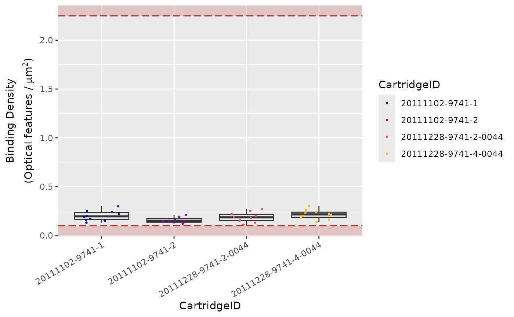

#### Imaging

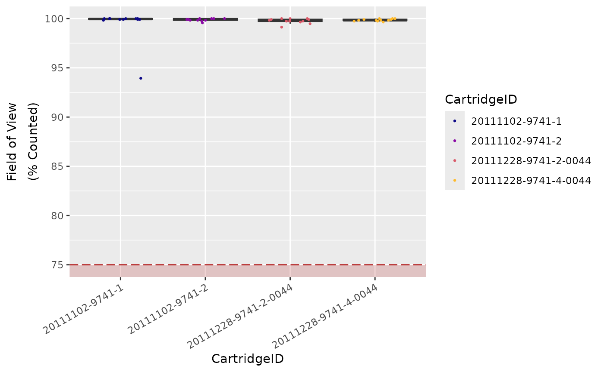

#### Positive Control Linearity

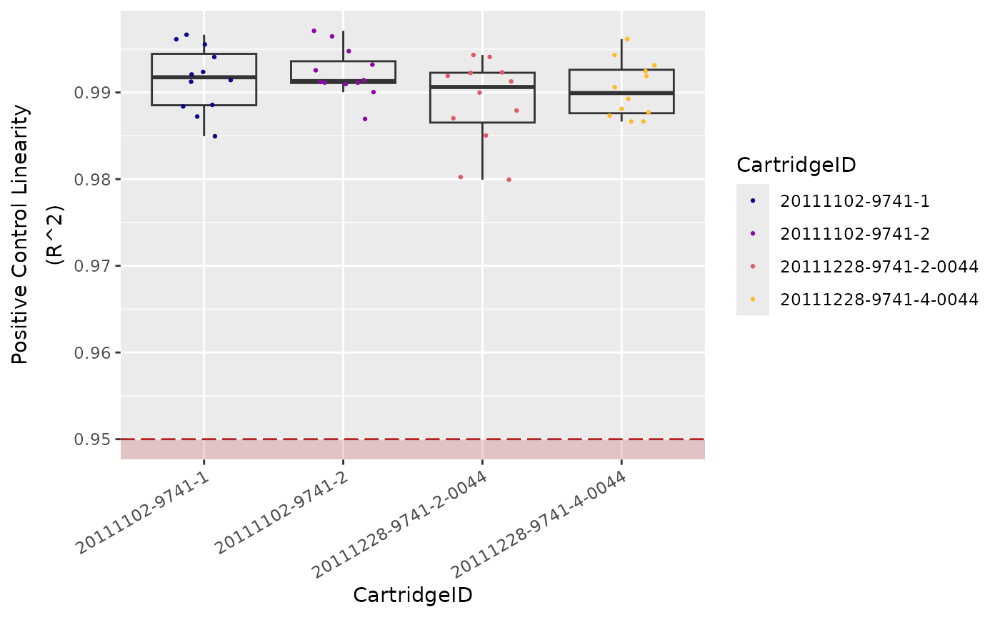

#### Limit of Detection

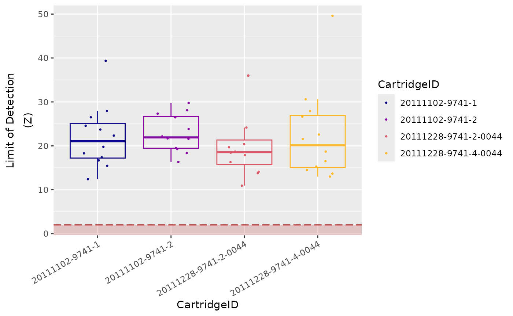

#### Positive Controls

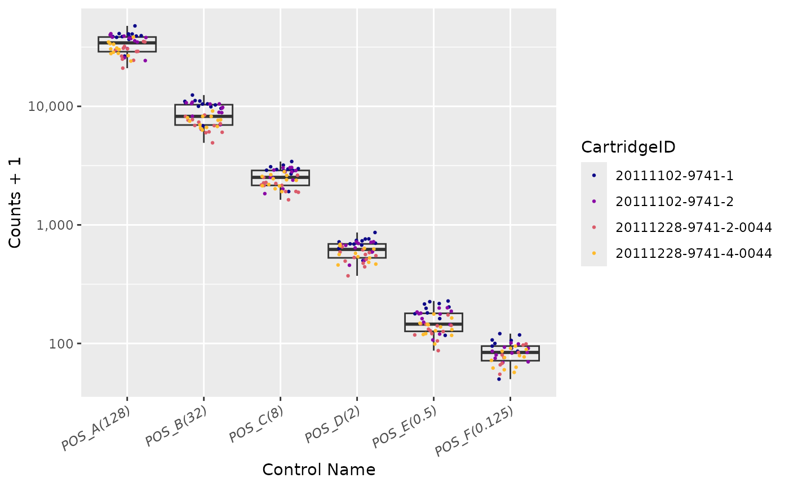

#### Negative Controls

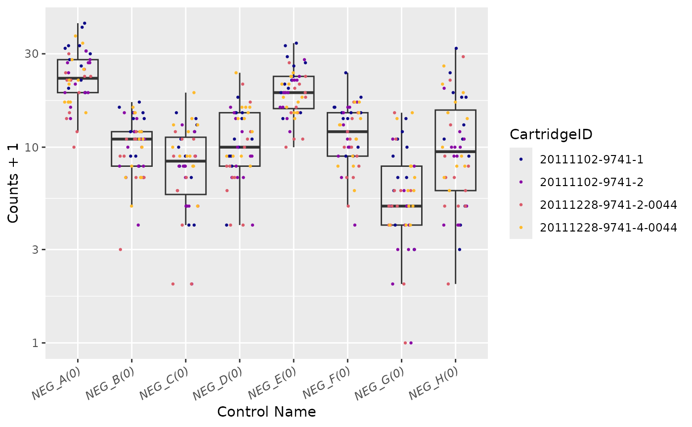

#### Housekeeping Genes

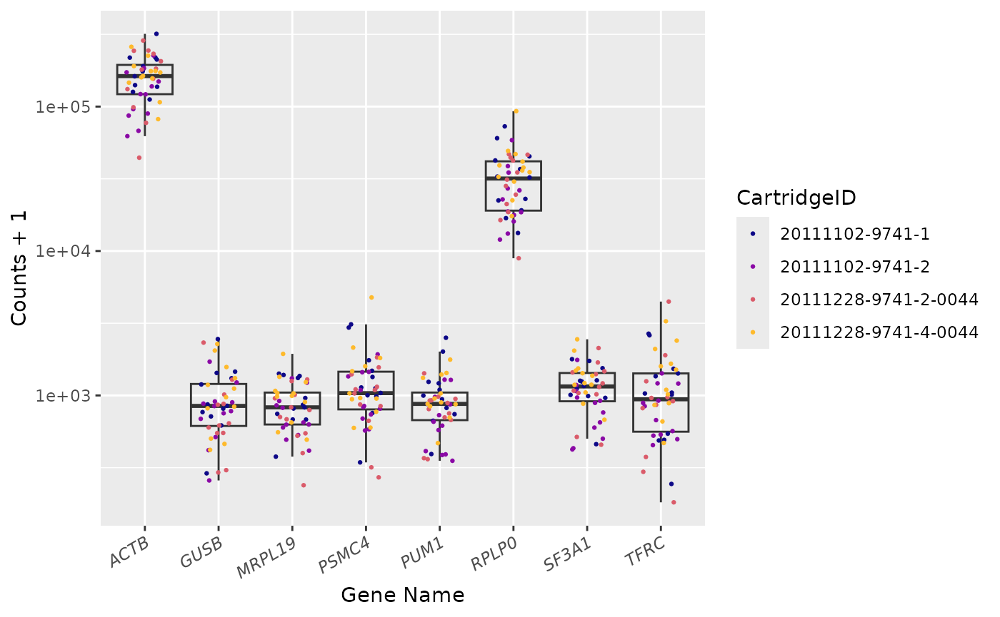

#### Positive Controls vs. Negative Controls

    ## `geom_smooth()` using formula = 'y ~ x'


#### Average Counts vs. Binding Density


#### Average Counts vs. Median Counts

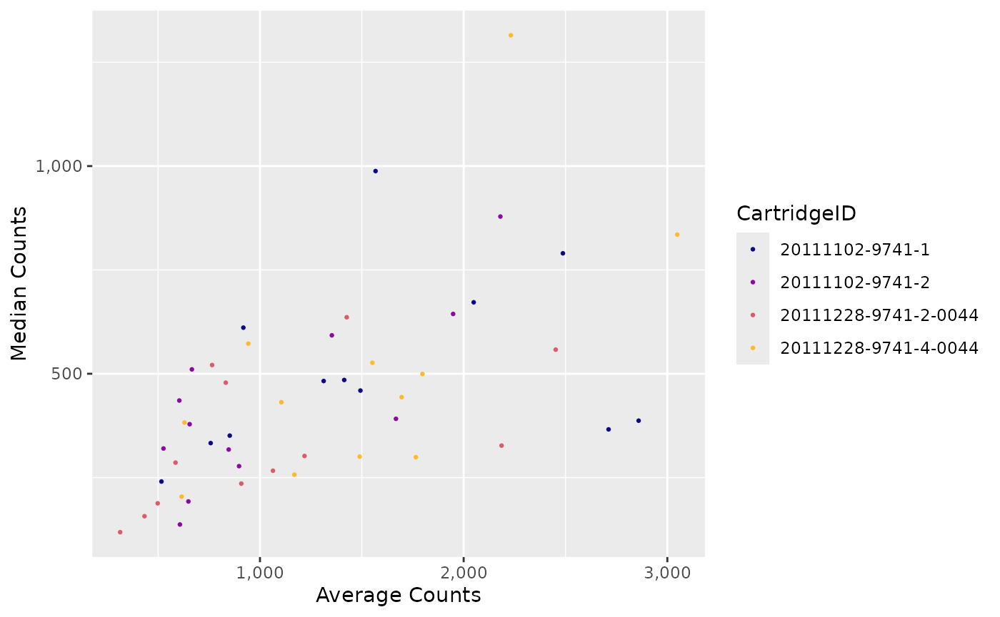

#### Principal Component 1 vs. 2


#### Principal Component scree plot

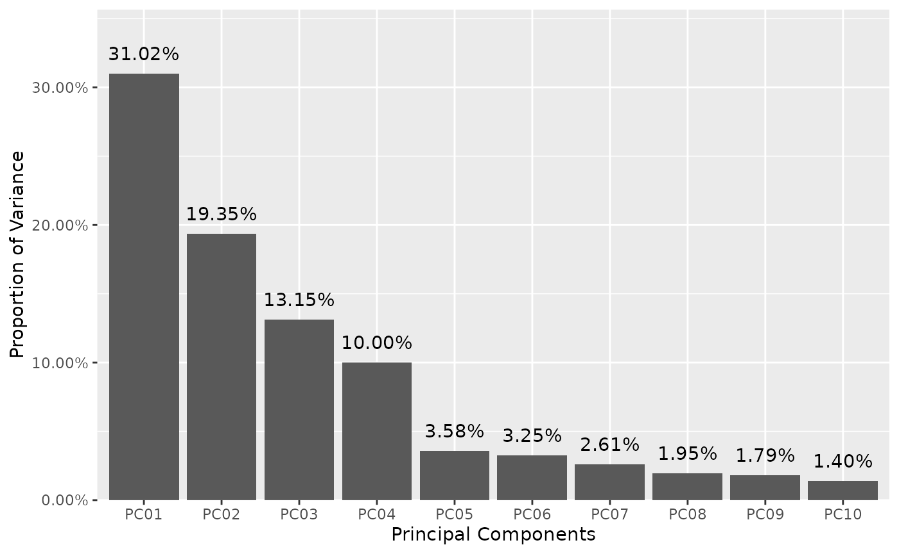

#### Principal Components planes


#### Positive Factor vs. Negative Factor

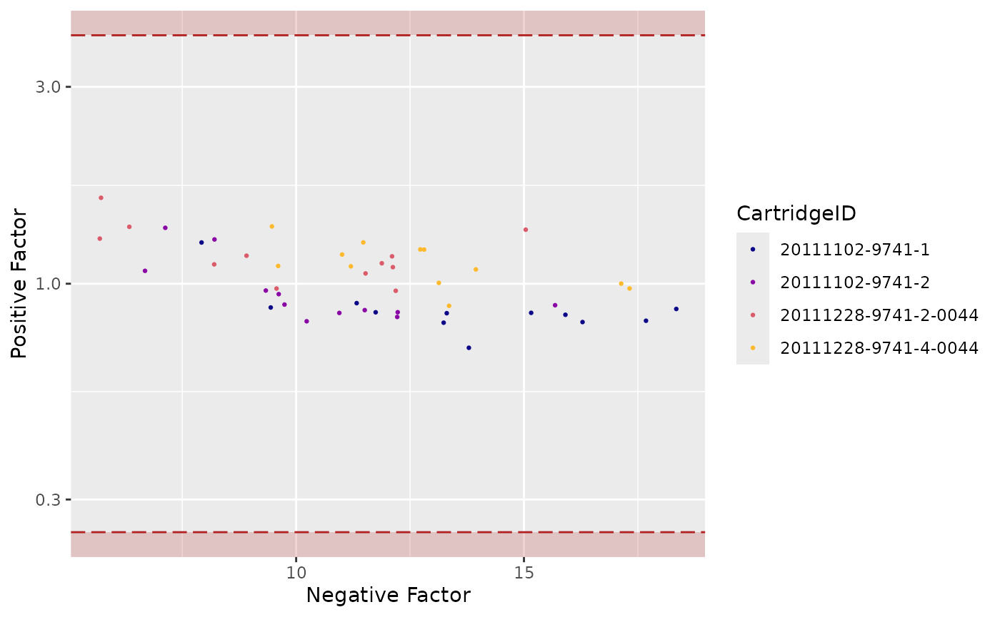

#### Housekeeping Factor


#### Normalisation Factor

    ## `geom_smooth()` using formula = 'y ~ x'

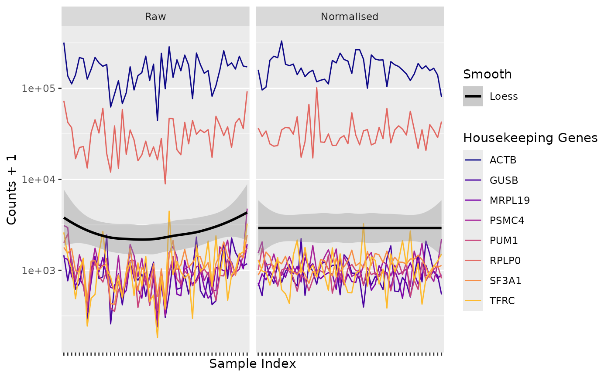

### NACHO as a standalone app

*NACHO* is also available as a standalone app to be used in a Shiny
Server configuration. A convenience function
[`deploy()`](https://m.canouil.dev/NACHO/dev/reference/deploy.md) is
available to directly copy the *NACHO* app to the default directory of a
Shiny Server.

``` r

deploy(directory = "/srv/shiny-server", app_name = "NACHO")
```

The app can also be run directly, without manually summarising and
normalising RCC files:

``` r

shiny::runApp(system.file("app", package = "NACHO"))
```


### The `render()` function

The [`render()`](https://m.canouil.dev/NACHO/dev/reference/render.md)
function renders a comprehensive HTML report, using
`print(..., echo = TRUE)`, which includes all quality-control metrics
and description of those metrics.

``` r

render(
  nacho_object = GSE74821,
  colour = "CartridgeID",
  output_file = "NACHO_QC.html",
  output_dir = ".",
  size = 0.5,
  show_legend = TRUE,
  clean = TRUE
)
```

The underneath function [`print()`](https://rdrr.io/r/base/print.html)
can be used directly within any R Markdown chunk, setting the parameter
`echo = TRUE`.

``` r

print(
  x = GSE74821,
  colour = "CartridgeID",
  size = 0.5,
  show_legend = TRUE,
  echo = TRUE,
  title_level = 3
)
```

#### RCC Summary

- Samples: 48
- Endogenous: 50
- Housekeeping: 8
- Negative: 8
- Positive: 6

#### Settings

- Predict housekeeping genes: FALSE

- Normalise using housekeeping genes: TRUE

- Housekeeping genes available: MRPL19, PSMC4, SF3A1, RPLP0, PUM1, ACTB,
  TFRC and GUSB

- Normalise using: GLM

- Principal components to compute: 10

- Remove outliers: FALSE

  - Binding Density (BD) \< 0.1
  - Binding Density (BD) \> 2.25
  - Field of View (FoV) \< 75
  - Positive Control Linearity (PCL) \< 0.95
  - Limit of Detection (LoD) \< 2
  - Positive normalisation factor (Positive_factor) \< 0.25
  - Positive normalisation factor (Positive_factor) \> 4
  - Housekeeping normalisation factor (house_factor) \< 0.091
  - Housekeeping normalisation factor (house_factor) \> 11

#### QC Metrics

##### Binding Density

The imaging unit only counts the codes that are unambiguously
distinguishable.  
It simply will not count codes that overlap within an image.  
This provides increased confidence that the molecular counts you receive
are from truly recognisable codes.  
Under most conditions, forgoing the few barcodes that do overlap will
not impact your data.  
Too many overlapping codes in the image, however, will create a
condition called image saturation in which significant data loss could
occur (critical data loss from saturation is uncommon).

To determine the level of image saturation, the nCounter instrument
calculates the number of optical features per square micron for each
lane as it processes the images.  
This is called the **Binding Density** (**BD**).  
The **Binding Density** is useful for determining whether data
collection has been compromised due to image saturation. The acceptable
range for **Binding Density** is:

- `0.1 - 2.25` for **MAX**/**FLEX** instruments
- `0.1 - 1.8` for **SPRINT** instruments

Within these ranges, relatively few reporters on the slide surface will
overlap, enabling the instrument to accurately tabulate counts for each
reporter species.  
A **Binding Density** significantly greater than the upper limit in
either range is indicative of overlapping reporters on the slide
surface.  
The counts observed in lanes with a **Binding Density** at this level
may have had significant numbers of codes ignored, which could
potentially affect quantification and linearity of the assay.

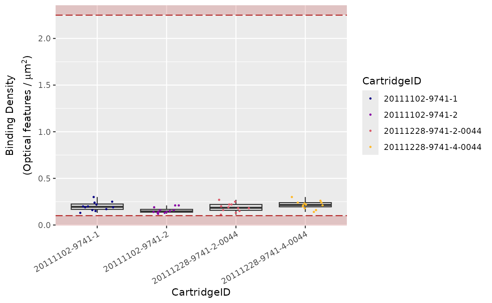

##### Field of View (Imaging)

Each individual lane scanned on an nCounter system is divided into a few
hundred imaging sections, called Fields of View (**FOV**), the exact
number of which will depend on the system being used (*i.e.*,
**MAX/FLEX** or **SPRINT**), and the scanner settings selected by the
user.  
The system images these **FOV**s separately, and sums the barcode counts
of all **FOV**s from a single lane to form the final raw data count for
each unique barcode target.  
Finally, the system reports the number of **FOV**s successfully imaged
as **FOV** Counted.

Significant discrepancy between the number of **FOV** for which imaging
was attempted (**FOV Count**) and for which imaging was successful
(**FOV Counted**) may indicate an issue with imaging performance.  
Recommended percentage of registered FOVs (*i.e.*, **FOV Counted** over
**FOV Count**) is `75 %`.


##### Positive Control Linearity

Six synthetic DNA control targets are included with every nCounter Gene
Expression assay.  
Their concentrations range linearly (in *codeset*) from `128 fM` to
`0.125 fM`, and they are referred to as **POS_A** to **POS_F**,
respectively.  
These **Positive Controls** are typically used to measure the efficiency
of the hybridization reaction, and their step-wise concentrations also
make them useful in checking the linearity performance of the assay.

Since the known concentrations of the **Positive Controls** increase in
a linear fashion, the resulting counts should, as well.

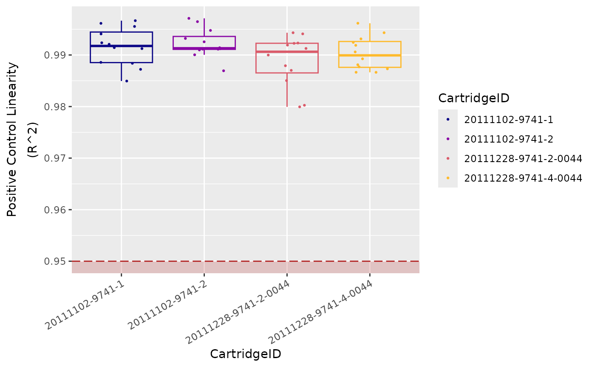

##### Limit of Detection

The limit of detection (**LoD**) is determined by measuring the ability
to detect **POS_E**, the `0.5 fM` positive control probe, which
corresponds to about 10,000 copies of this target within each sample
tube.  
On a **FLEX**/**MAX** system, the standard input of `100 ng` of total
RNA will roughly correspond to about 10,000 cell equivalents (assuming
one cell contains `10 pg` total RNA on average).  
An nCounter assay run on the **FLEX**/**MAX** system should thus
conservatively be able to detect roughly one transcript copy per cell
for each target (or 10,000 total transcript copies).  
In most (codeset) assays, you will observe that even the **POS_F** probe
(equivalent to 0.25 copies per cell) is detectable above background.

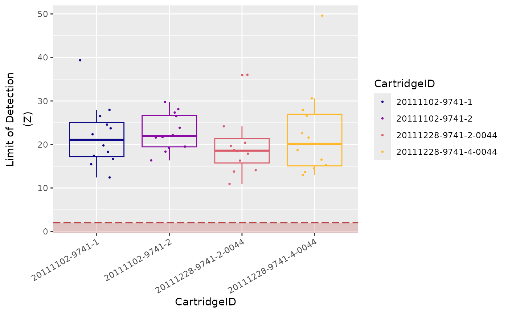

#### Control Genes

##### Positive

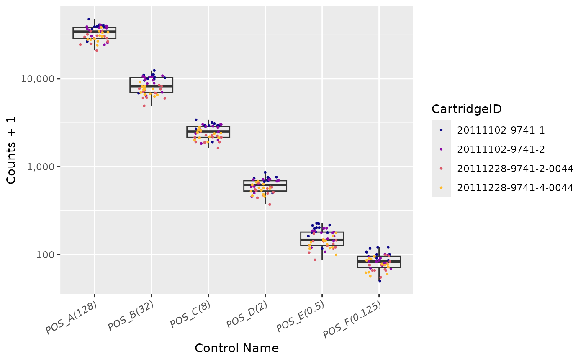

##### Negative

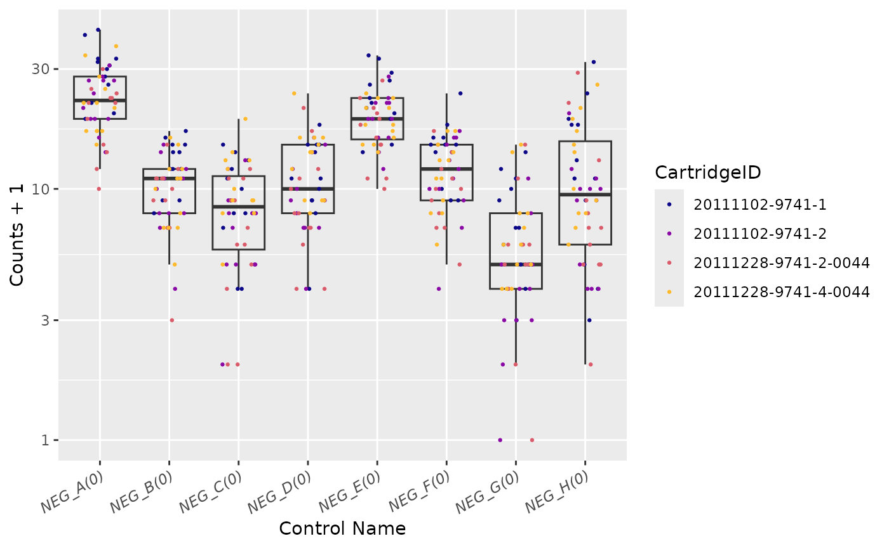

##### Housekeeping

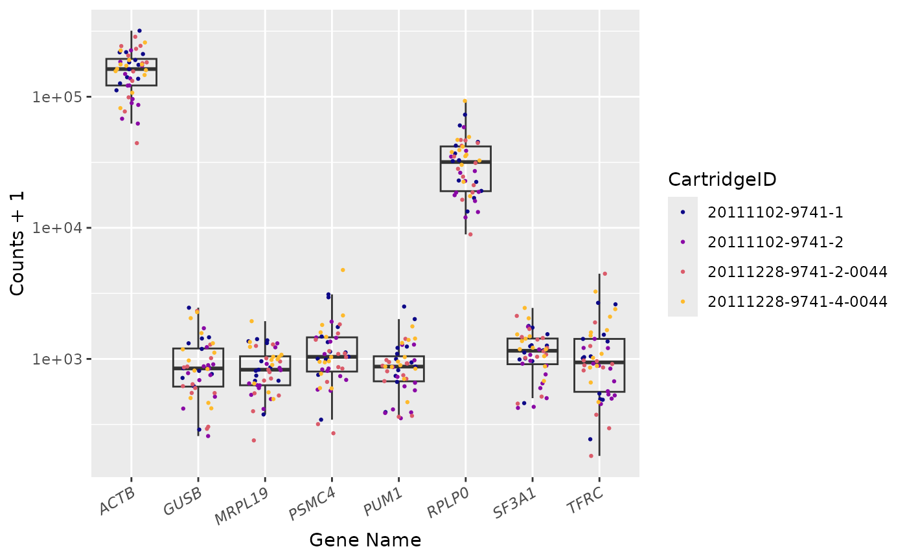

##### Control Probe Expression

    ## `geom_smooth()` using formula = 'y ~ x'

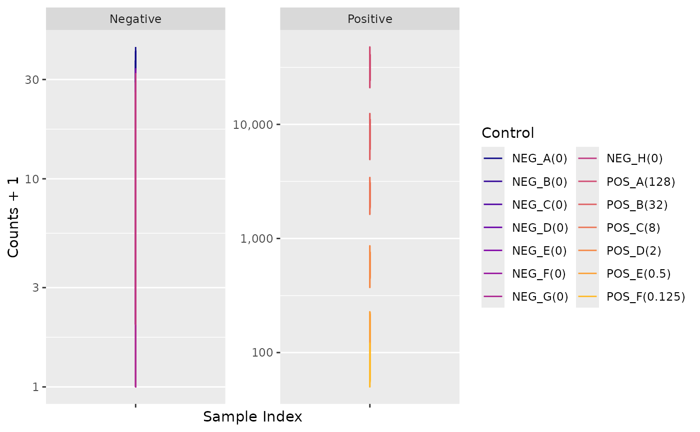

#### Quality-Control Visuals

##### Average Count vs. Binding Density

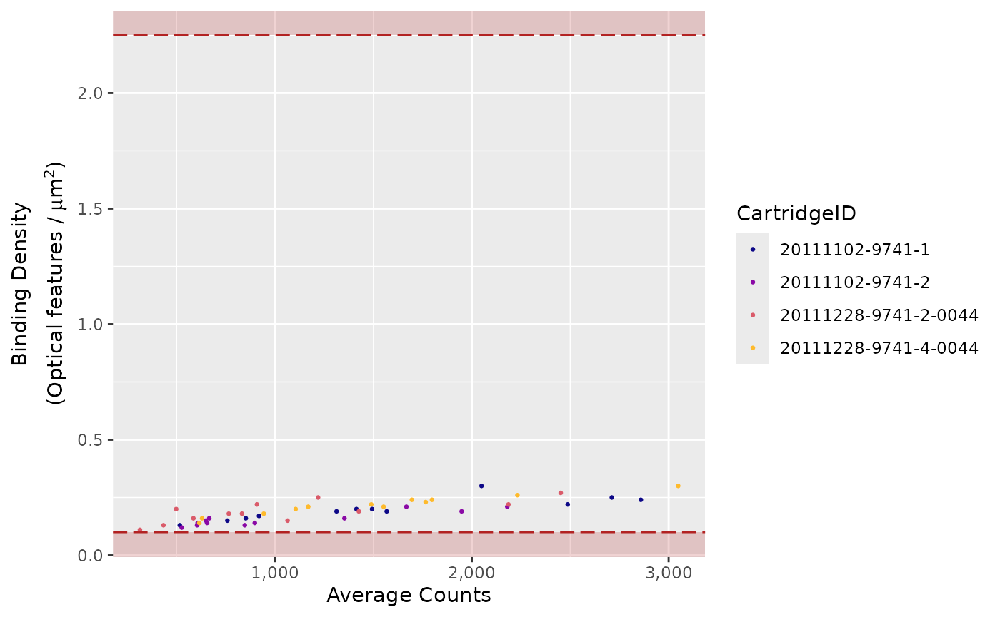

##### Average Count vs. Median Count


##### Principal Component

###### PC1 vs. PC2

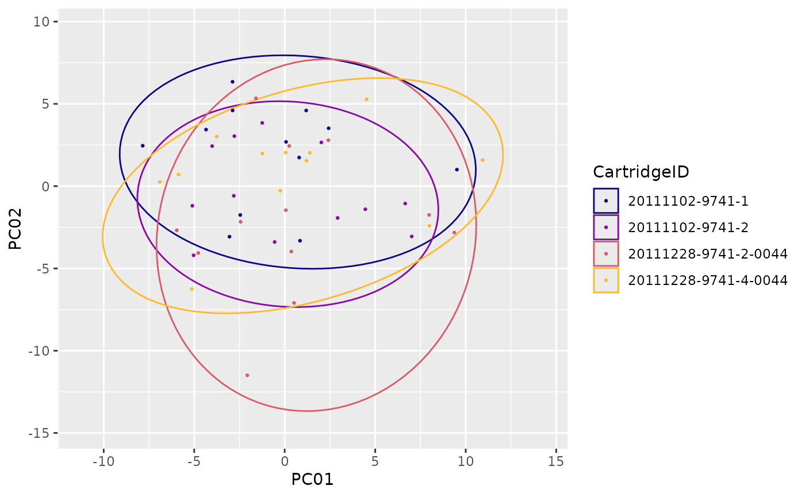

###### Factorial planes

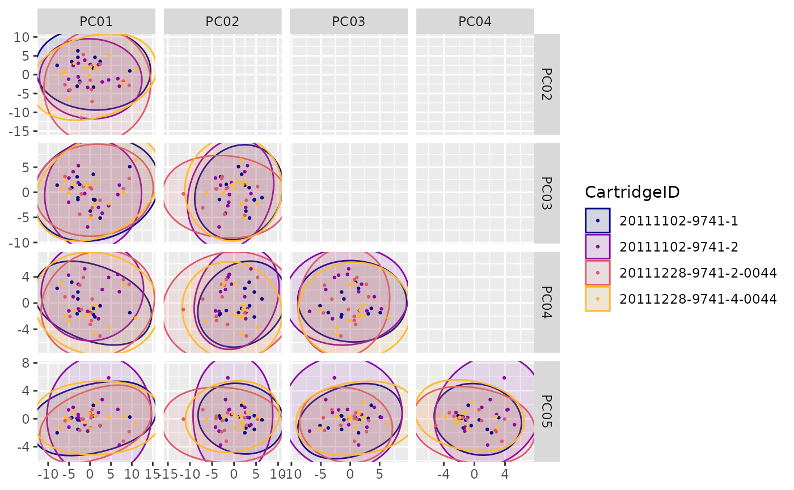

###### Proportion of Variance Explained


#### Normalisation

##### Positive Factor vs. Background Threshold


##### Housekeeping Factor

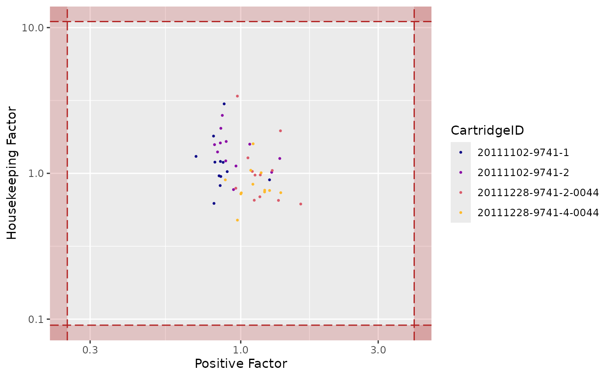

##### Normalisation Result

    ## `geom_smooth()` using formula = 'y ~ x'


## References

Barrett, Tanya, Stephen E. Wilhite, Pierre Ledoux, et al. 2013. “NCBI
GEO: Archive for Functional Genomics Data Sets—Update.” *Nucleic Acids
Research* 41 (January): D991–95. <https://doi.org/10.1093/nar/gks1193>.

Bruce, Jeff P., Angela B. Y. Hui, Wei Shi, et al. 2015. “Identification
of a microRNA Signature Associated with Risk of Distant Metastasis in
Nasopharyngeal Carcinoma.” *Oncotarget* 6 (6): 4537–50.
<https://doi.org/10.18632/oncotarget.3005>.

Liu, Minetta C., Brandelyn N. Pitcher, Elaine R. Mardis, et al. 2016.
“PAM50 Gene Signatures and Breast Cancer Prognosis with Adjuvant
Anthracycline- and Taxane-Based Chemotherapy: Correlative Analysis of
C9741 (Alliance).” *Npj Breast Cancer* 2 (January): 15023.
<https://doi.org/10.1038/npjbcancer.2015.23>.
