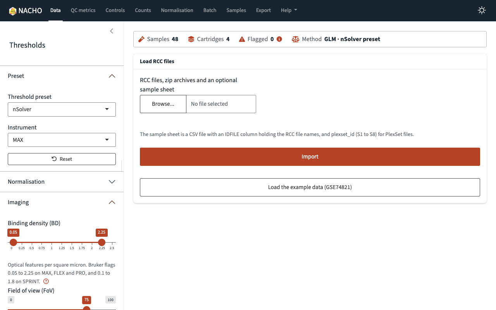
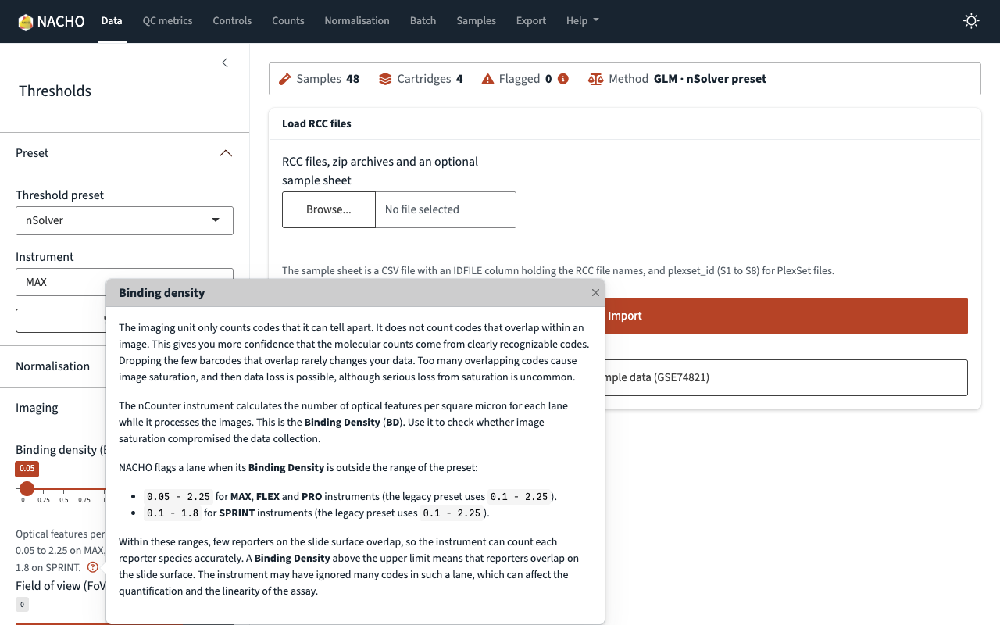
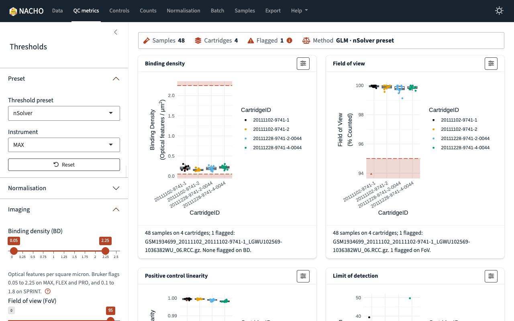
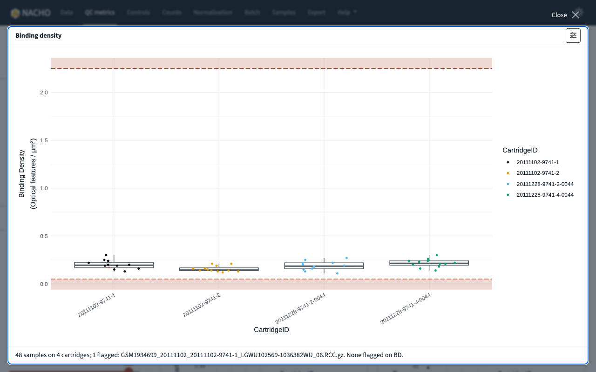
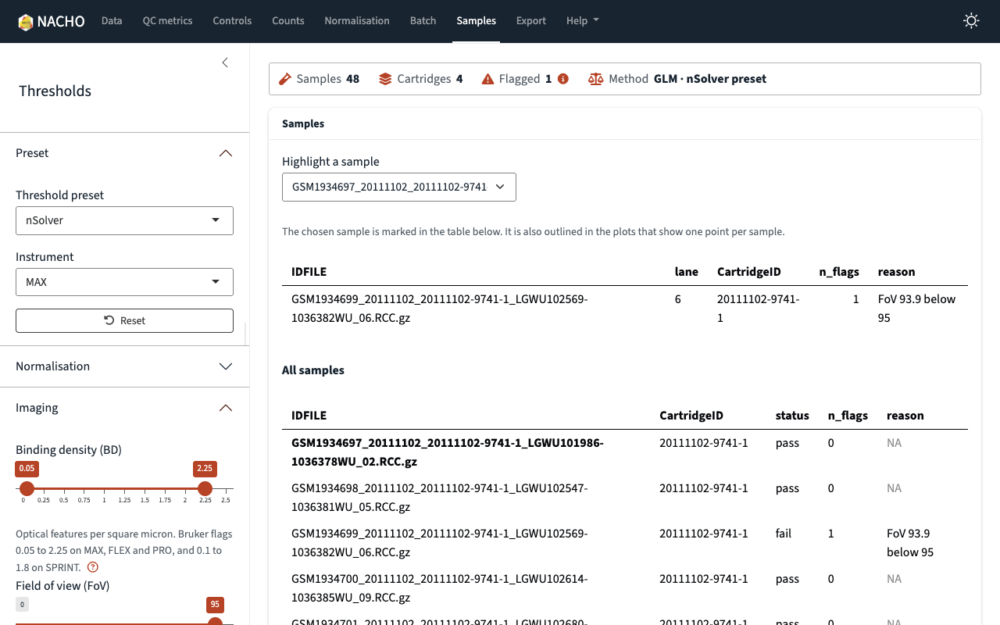
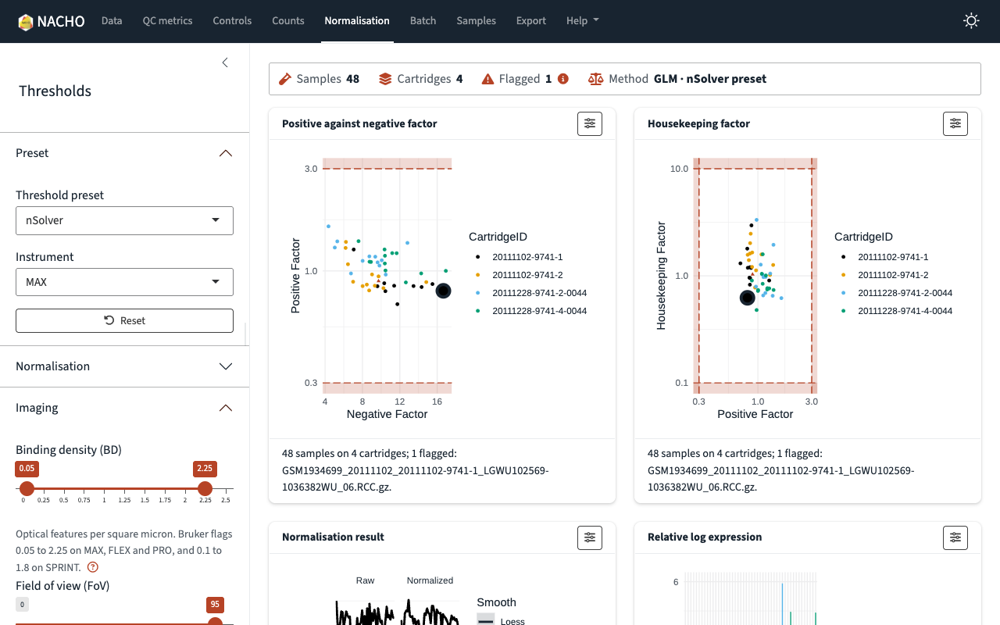
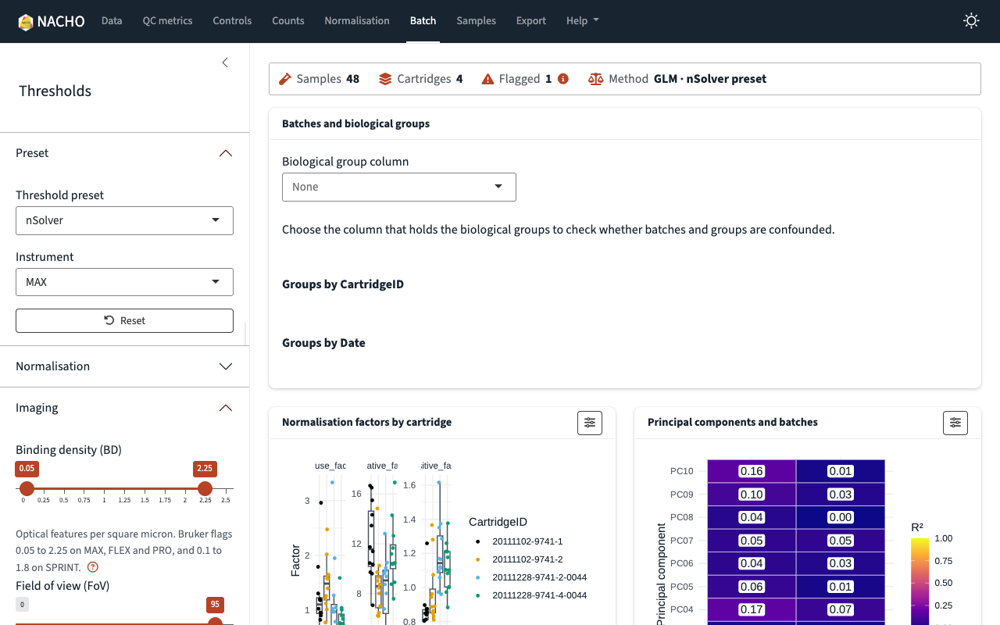
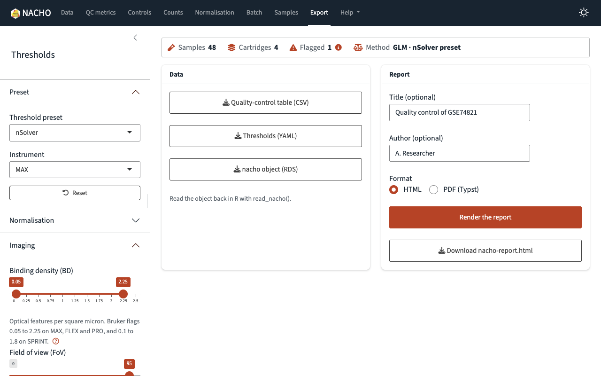
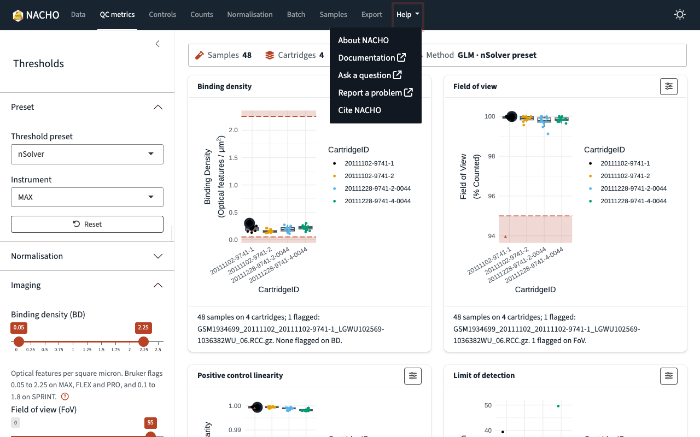
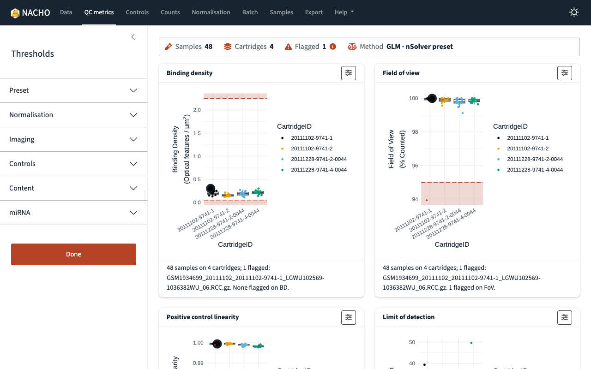

```{r}
#| label: setup
#| include: false
knitr::opts_chunk$set(collapse = TRUE, comment = "#>", out.width = "100%")
```

The NACHO app is a dashboard for the quality control of NanoString nCounter data.
You load a study, change the thresholds, look at the plots, and export the result.
This article walks through the app with the example data `GSE74821`.
Each picture shows the app in light mode.
The app also has a dark mode, which you can switch on at the right of the navigation bar.

## Start the app

There are three ways to start the app.

- `visualise()` opens the app on a `nacho` object in your R session.
  When you click **Done**, the app closes and returns the object with your thresholds and settings.
- `nacho_app()` returns a Shiny app object.
  Pass it to `shiny::runApp()`, or give it to a server.
- `deploy()` copies the app to a directory, for example for a Shiny Server.

```{r}
#| eval: false
library(NACHO)
tuned <- visualise(GSE74821)
```

To start with an empty app and upload your own files, call `nacho_app()` without an argument.

```{r}
#| eval: false
shiny::runApp(nacho_app())
```

## Load data

The **Data** page loads a study.
Choose RCC files, zip archives and an optional sample sheet, then click **Import**.
The sample sheet is a CSV file with an `IDFILE` column that holds the RCC file names.
For PlexSet files, it also has a `plexset_id` column with the values S1 to S8.
To try the app first, click **Load the example data (GSE74821)**.

Above every page, a summary strip shows the number of samples, the number of cartridges, the number of flagged samples and the method.
The strip changes when you change the thresholds.
Point at the information icon next to **Flagged** to see why samples are flagged.

```{r}
#| echo: false
#| fig-alt: >-
#|   The Data page of the NACHO app. A summary strip shows 48 samples, 4
#|   cartridges, no flagged samples and the GLM method. Below it, a card lets
#|   you choose RCC files and load the example data. The threshold sidebar is
#|   on the left.

```

## Set the thresholds

The sidebar on the left holds the thresholds and the normalisation settings.
Every page uses them.

- **Preset** gives a set of starting thresholds.
  Choose the `nSolver` preset or the `NACHO 2` preset, and choose your instrument.
  **Reset** returns the thresholds to the preset.
- **Normalisation** sets the method, the background, the background mode and, for RUVg, the number of unwanted factors.
  To choose that number, use `suggest_ruv_k()` in R.
- The other sections hold one slider for each threshold, grouped as imaging, controls, content and miRNA.

Click the question mark below a slider to read how NACHO uses that metric.

```{r}
#| echo: false
#| fig-alt: >-
#|   The help popover for binding density, opened over the Data page. It
#|   explains how the instrument counts codes and lists the accepted range of
#|   binding density for each instrument.

```

When you move a slider, the flagged samples and the plots change at once.
For example, a field of view threshold of 95 flags one sample of `GSE74821`.

## Read the plots

Five pages show plots.
Each page answers one question.

- **QC metrics** shows the imaging, linearity and limit of detection metrics, with the thresholds drawn as shaded bands.
- **Controls** shows the positive controls, the negative controls, the housekeeping genes and the control probes.
- **Counts** shows counts against the quality metrics, and the principal components.
- **Normalisation** shows the normalisation factors, the result of the normalisation and the stability of the housekeeping genes.
- **Batch** shows how the normalisation factors and the principal components relate to the batches.

```{r}
#| echo: false
#| fig-alt: >-
#|   The QC metrics page. Cards for binding density and field of view show one
#|   box plot for each cartridge, with the flagged sample marked below the
#|   lower threshold of field of view.

```

A page shows only the plots that your data can draw.
For example, the housekeeping plots appear only when the study has housekeeping genes.

### Display options and full screen

Each plot card has a button with sliders in its top right corner.
It opens the display options.
There you choose the variable that colours the points, show or hide the legend, and choose a column to label the flagged samples.
You can also change the point size, and download the plot as a PNG file with a width and height in centimetres.

The full-screen button appears at the bottom right of a card when you point at it.
Click it to see the plot at the size of the window.
Click **Close**, or press the Escape key, to go back.

```{r}
#| echo: false
#| fig-alt: >-
#|   The binding density plot in full-screen view. The box plots of the four
#|   cartridges fill the window, and a Close button is at the top right.

```

## Select a sample

The plots that show one point for each sample are linked.
If you select a sample in one place, the app outlines it in all of them.

Click a point in a plot, or choose a sample in **Highlight a sample** on the **Samples** page.
The **Samples** page marks the sample in its table.
The plots on the other pages outline the same sample.
To clear the selection, choose **None**.

```{r}
#| echo: false
#| fig-alt: >-
#|   The QC metrics page with one sample selected. The sample appears as a
#|   large dark circle in the binding density, field of view and linearity
#|   plots.

```

```{r}
#| echo: false
#| fig-alt: >-
#|   The Samples page. A table lists the flagged sample with its lane,
#|   cartridge and the reason, and a second table lists all samples, with the
#|   selected sample in bold.

```

## Normalisation and batch

The **Normalisation** page shows the factors that the app uses to scale the samples, and the result.
If you change the method in the sidebar, the page updates.
The **Batch** page checks whether the batches and the biological groups are confounded.
Choose the column that holds your groups to see the table.

```{r}
#| echo: false
#| fig-alt: >-
#|   The Normalisation page. The first card plots the positive factor against
#|   the negative factor, and the second plots the housekeeping factor against
#|   the positive factor. Shaded bands show the thresholds and the selected
#|   sample is outlined.

```

```{r}
#| echo: false
#| fig-alt: >-
#|   The Batch page. A card asks for the biological group column. Two cards
#|   below show normalisation factors for each cartridge and a heat map of the
#|   principal components against the batches.

```

## Export the results

The **Export** page saves your work.

- **Quality-control table (CSV)** holds the quality-control metrics and the status of each sample.
- **Thresholds (YAML)** holds the thresholds that you set.
- **nacho object (RDS)** holds the object.
  Read it back in R with `read_nacho()`.
- **Render the report** builds a quality-control report.

For the report, enter a title and an author, both optional, and choose HTML or PDF (Typst).
Then click **Render the report**.
When the report is ready, a button with its file name appears.
The report needs the Quarto command-line interface 1.9.18 or newer and the `quarto` package where the app runs.
If you have the `mirai` package, the app renders the report in the background.

```{r}
#| echo: false
#| fig-alt: >-
#|   The Export page. A card lists three download buttons for the data. A
#|   second card holds the title and author fields, the HTML and PDF choice,
#|   the Render the report button, and a button to download the finished
#|   report.

```

## Help

The **Help** menu in the navigation bar has five items.

- **About NACHO** explains the app.
- **Documentation** opens this website.
- **Ask a question** opens the discussions on GitHub.
- **Report a problem** opens the issues on GitHub.
- **Cite NACHO** shows how to cite the package.

```{r}
#| echo: false
#| fig-alt: >-
#|   The Help menu open over the QC metrics page. It lists About NACHO,
#|   Documentation, Ask a question, Report a problem and Cite NACHO.

```

## Finish with Done

When you start the app with `visualise()`, the sidebar has a **Done** button.
Click it to close the app.
`visualise()` then returns the `nacho` object with your thresholds and settings.
Use this object in the rest of your analysis.
If the chosen normalisation method cannot work with your data, the app shows a message and stays open.

```{r}
#| echo: false
#| fig-alt: >-
#|   The sidebar with its sections folded. The Done button is below the
#|   sections, and the QC metrics plots are on the right.

```

## Plot workers

When the `mirai` and `ggiraph` packages are installed, the app builds the interactive plots of a page at the same time, in background R processes.
These processes are the plot workers.
By default, the app starts one worker for each CPU core minus one, with a maximum of four.
The app from `deploy()` starts one worker.

Each worker keeps a copy of the study, so its memory grows with the size of the study.
For `GSE74821`, each worker uses about 170 MB.
To change the number of workers, set the `nacho.plot_workers` option before you start the app.

```{r}
#| eval: false
options(nacho.plot_workers = 2)
visualise(GSE74821)
```

To build all plots in the app process, set the option to `0`.
If the workers do not start, the app builds the plots in its own process.
The workers use the installed NACHO package.
All users of one R process share its workers and its plot cache.
